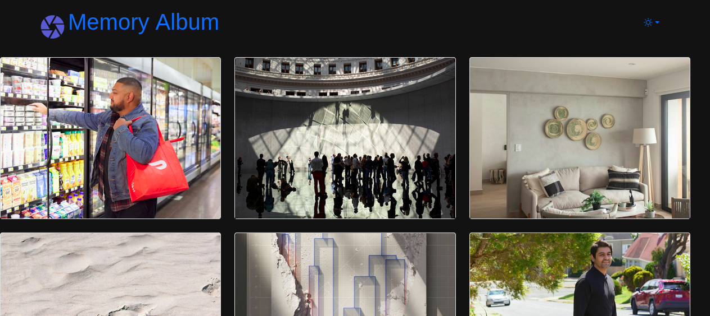

# The Album App

The Album App is designed to provide a seamless and modern experience for users to view their photo collections. The app utilizes a sleek, user-friendly interface with infinite scrolling to load more photos as the user navigates through their album. Additionally, the app integrates with the Unsplash API to provide users with access to a vast library of high-quality photos.

## Key Features

- **Sleek Interface**: The app boasts a modern and visually appealing interface that enhances the user experience.

- **Viewing Albums**: Upon opening the app, users are presented with a list of their albums. They can select an album to view its contents.

- **Infinite Scrolling**: Utilizing infinite scrolling, the app dynamically loads more photos as the user navigates through their album, providing a smooth and uninterrupted browsing experience.

- **Integration with Unsplash API**: The app seamlessly integrates with the Unsplash API, allowing users to access a vast library of high-quality photos to enhance their albums.

## How it Works

1. **Viewing Albums**: Users can select an album from the list to view its contents.

2. **Infinite Scrolling**: As users scroll through their album, more photos are seamlessly loaded, ensuring a smooth browsing experience without interruptions.

## Benefits

- **User-Friendly**: The app's intuitive interface makes it easy for users to navigate through their photo collections.

- **Seamless Integration**: Integration with the Unsplash API provides users with access to a vast library of high-quality photos.

## Get Started

The Album App is a view-only application, allowing users to effortlessly browse through their photo collections. No installation is required. Simply access the app through the provided link below and start exploring your albums!

[Access The Album App](#)
